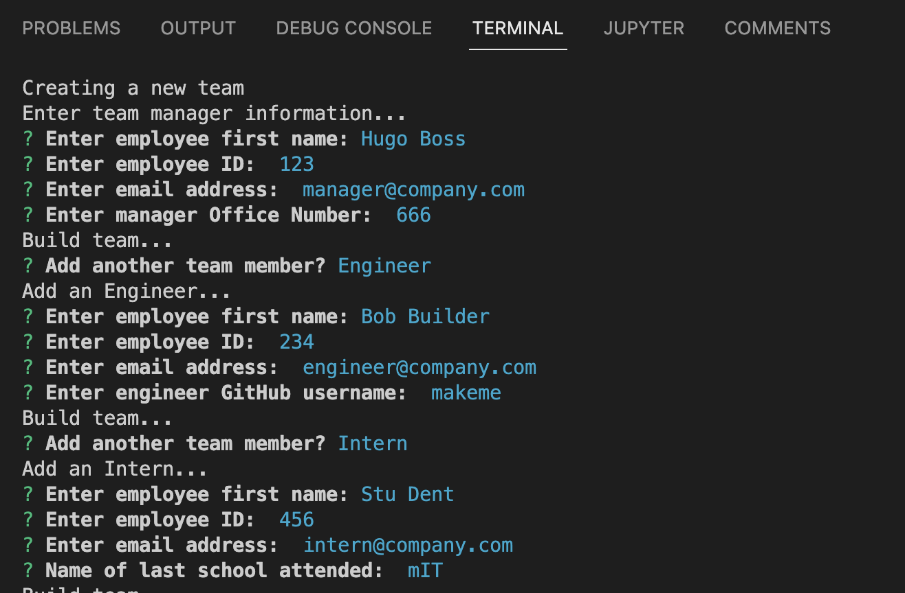
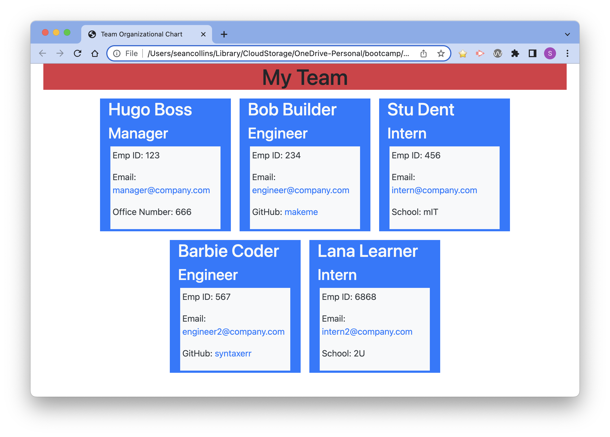

# Team Profile Generator

A Node.js command-line application takes in information about employees and generates an HTML webpage that displays summaries for each person.

## Description

Project teams often have a website that provides information about their group, and the work they perform.  This tool can be used to build a team profile for display on a corporate intranet or other web service.

This project extends the web-coding knowledge base we are building in our boot camp by incorporating Object Oriented Programming concepts and modularization (multiple files linked with export/require statement pairs).

## Table of Contents

- [Installation](#installation)
- [Usage](#usage)
- [License](#license)
- [Contribute](#contribute)

## Installation

- Clone or download the repository.
- At the command-prompt, run `npm install` to add dependencies.

## Usage

- To run the program, switch to the code directory and run `node index.js`.
- Follow the prompts to add a team Manager, and as many Engineers or Interns as needed.
- When finished, choose `Finish Building Team`, and an `index.html` file will be generated under the `./dist` folder.
- Launch the file in a browser to see content.
- Click any email address to open a new email in your default email client to the selected contact.  The address will automatically be added to the To: field.
- Click any Engineer's GitHub link to open their GitHub profile in a new browser tab.

**Video Walkthrough**

- Watch a [Demo Video](https://watch.screencastify.com/v/l44xAbW9SktMxuXvgp9j)

**Screen Shots**

## License

[MIT License](LICENSE/)

## Contribute

The [Contributor Covenant](https://www.contributor-covenant.org/) is an industry standard, but you can always write your own if you'd prefer.

Please open a new Issue on the GitHub repo.